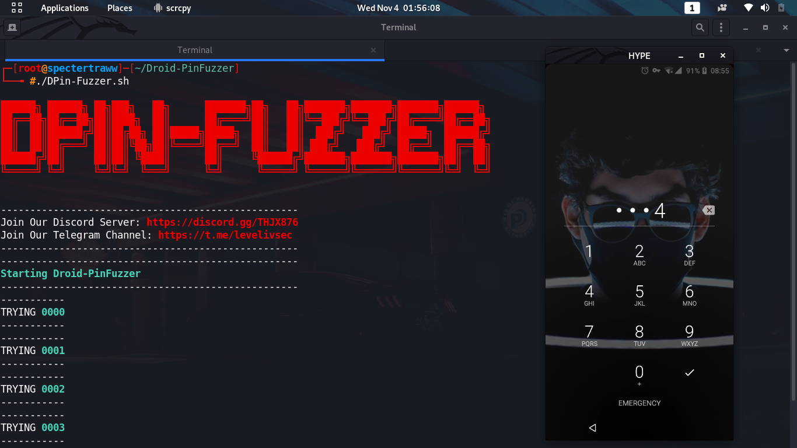

# Droid-PinFuzzer(Brute Force Android Lock Screen Pins)
#        (4 Digit PIN ONLY)
# In the future Updates will add up to 12 digit pin.

Join Our Discord Server: https://discord.gg/THJX876

Join Our Telegram Channel:https://t.me/levelivsec

It is a simple shell script that brute force Android Lock screen (When USB DEBUGGING is enable) its uses ADB tools FOR Brute Forcing
To use this 1st you Have to Install the adb Driver in linux to install that you can type the following Command on terminal
$ apt-get -y install android-tools-adb android-tools-fastboot
This will Download all the necessary File required to do bruteforce 
once you download adb tools now you only need to enable (usb DEBUGGING) on victims phone

STEP'S :-

Connect victim (usb debugging enable) phone on your laptop using usb cable then type adb devices in terminal 
that will show devies is offline to bring that online disconnect usb from android phone then reconnect usb cable
now again type  (adb devices on a terminal) handshake will prompt on a android device click ok now you are good to go when victim will lock the screen you only have to plug usb cable to a victim phone run the DPin-Fuzzer.sh  file brute force will start

To run the DPin-Fuzzer.sh  File 

Go to the location where you have saved the given file for Example if you have saved the file on Downloads just go to Download Directory using command :- cd Downloads 

1st make DPin-Fuzzer.sh  file executable to do that just type (chmod +x DPin-Fuzzer.sh ) using terminal 
now jst type ( ./DPin-Fuzzer.sh  ) without bracket :-P
Brute Force will start on device it will start combination of all the 4 digit pin right from (0000 to 9999)
